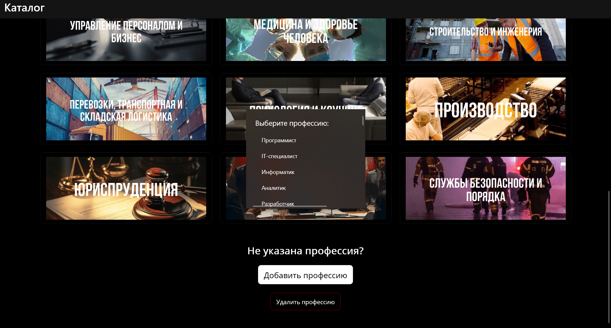

**Общая информация о Каталог Профессий**
- Год разработки: 2023
- Стек: язык C#, платформа .NET MAUI, среда разработки Microsoft Visual Studio 2022, формат хранения данных XML
Это первый проект с графическим пользовательским интерфейсом, в котором реализованы основные принципы работы с интерфейсом и данными

**Описание проекта**  
Приложение представляет собой информационно-справочную систему для знакомства с миром профессий. Оно позволяет структурированно просматривать информацию о различных специальностях, искать интересующие направления и получать детальные описания.

**Структура данных**  
Первый уровень – Каталог: содержит все доступные направления профессий и управляет общей логикой работы с данными
Второй уровень – Направления: группируют профессии по сферам деятельности, каждое направление имеет название, краткое описание и визуальное оформление
Третий уровень – Профессии: конкретные специальности внутри каждого направления, содержащие название и развернутое описание

**Управление содержанием**
- Добавление новых профессий 
- Удаление профессий через удобное меню выбора с подтверждением действия
- Автоматическое сохранение всех изменений для обеспечения актуальности данных
- Хранение информации в формате XML
- Загрузка данных из файла при запуске приложения
- Использование стандартных средств сериализации .NET

**Пользовательский интерфейс**
- Интуитивно понятная навигация
- Элементы управления создаются как статически в разметке, так и динамически в коде

**Демонстрируемые навыки**
- Создание иерархии классов для моделирования предметной области
- Написание методов для поиска и сортировки информации
- Обработка пользовательских событий
- Работа с файлами и потоками данных
- Организация навигации между страницами
- Проектирование удобного пользовательского интерфейса
- Применение технологии XAML для создания интерфейса
- Сериализация и десериализация XML данных
- Поиск по ключевым словам
- Сортировка для удобного просмотра
- Самостоятельное добавление
- Удаление

  ## Скриншоты приложения
Главный экран с ккатегориями, поиском сортировокой

Список профессий (аналогично с поиском, сортировкой)

Детальная информация о профессии

Главный экран с кнопками удаления, добавления 

  
